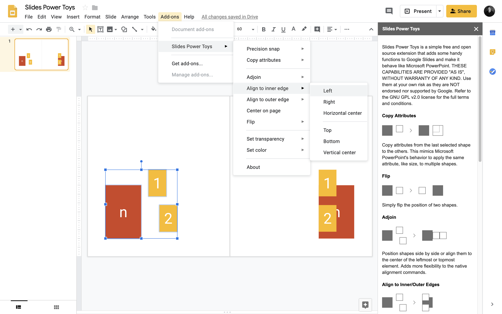

Slides Power Toys is a simple free and open source extension that adds some handy functions to Google Slides and make it behave like Microsoft PowerPoint.

    

**THESE CAPABILITIES ARE PROVIDED "AS IS", WITHOUT WARRANTY OF ANY KIND. Use them at your own risk as they are NOT endorsed nor supported by Google. Refer to the GNU GPL v2.0 license for the full terms and conditions.**

**This is not an oficially supported Google product.**

### Copy Attributes
Copy attributes from the last selected shape to the others. This mimics Microsoft PowerPoint's behavior to apply the same attribute, like size, to multiple shapes.

### Flip
Simply flip the position of two shapes.

### Adjoin
Position shapes side by side or align them to the center of the leftmost or topmost element. Adds more flexibility to the native alignment commands.

### Align to Inner/Outer Edges
Alignment commands to arrange shapes relative to the last selected element. Also adds more flexibility to the native alignment commands.

### Precision Snap
Commands to round various shape attributes to the closest decimal. A width of 1.23 inches becomes 1.2 inches. Select the elements to apply transformation to or select the slide to apply transformation to all elements.

## Color commands
### Transparency
Easily set transparency to selected shapes while preserving original colors.

### Swap text with background
Swap foreground color of text on all shapes (text boxes) selected or on the slide with each shape's fill color.

### Invert background colors
Invert fill color of all shapes (text boxes) selected or on the slide.

### Max text contrast
Change foreground color of text on all shapes (text boxes) selected or on the slide to either black or white, depending on which renders highest contrast with each shape's fill color.

## Tests
There is limited test coverage on the [tests.js](./tests/tests.js) file that uses [GasT](https://github.com/huan/gast). To run the tests, open the file on the Script Editor, run the gastTestRunner function and check the log.

## License
Licensed under the [GNU GPL v2.0 license](./LICENSE).